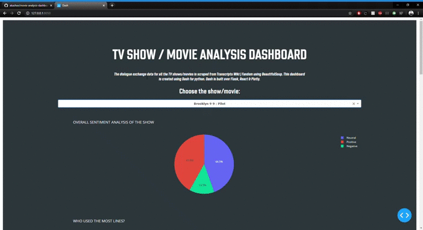

#### movie-analysis-dashboard
## TV Show/Movie Analysis Dashboard using Plotly-dash

### Abstract
There are a lot of visualization tools like Tableau, etc that make dashboards easy to build. But what if you are restricted to using only python? Can you build an interactive dashboard using just python? Of course you can! Dash by Plotly comes to the rescue while adressing this problem. It allows you to visualize your AI & ML results, and also allows you to build interactive dashboards where user can set certain parameters to get results.
I built this dashboard to visualize insights about my favorite shows/movies for my course EE 551 (Python Programming).

### Walkthrough
- **Web Scraping**\
The very first step is to gather the data. The data I am looking for looks like [this](https://transcripts.fandom.com/wiki/Avengers:_Infinity_War). Using _BeautifulSoup_, I scraped the website into a text file and then converted it into a .csv file with columns named Character and Dialogue. Now I had the data in the format I needed. I did this for a couple of TV show episodes and movies.
- **Natural Language Processing**\
I used NLP to extract _clean words_ from the dialogues and to carry out the _sentiment analysis_ for the show/movie. I also gathered other insights like 'Who used the most lines?', 'Who used the most words?', 'Most common words spoken by each character', etc.
- **Dashboard**\
Using _plotly-dash_, I build a dashboard to visualize all of this information together. I used pie chart to show the sentiment analysis as 'neutral', 'positive' or 'negative'; bar plots for all of the other info.
Bonus: To make it look visually good, I implemented a dark theme throughout, so I put a dark background and made the graphs transparent.

### Steps to run
- Run **web_scraping.py** to build datasets of all the dialogue exchanges of your favorite TV show/movie
- (if using my datasets) copy the datasets from the datasets folder to the folder with web_scraping.py and final_code.py
- Run **final_code.py** to implement NLP and build a dashboard
